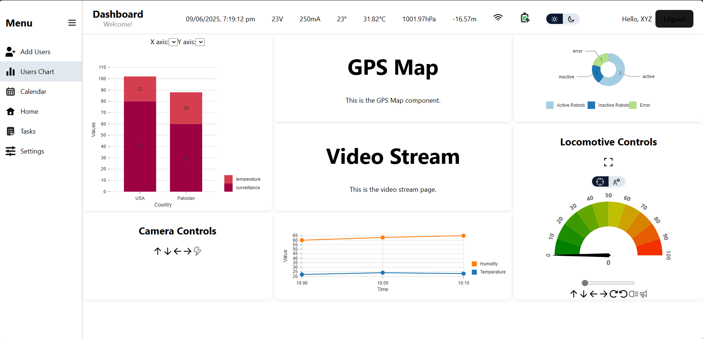

# HU Surveillance Robot 🚓📡

A smart surveillance system built using an **ESP32** microcontroller and a **React/Vite** web dashboard. This project enables real-time sensor monitoring, camera streaming, and robot control over a wireless network.

---

## 📁 Project Structure

Surveillance_robot/
├── ESP32/         # ESP32 Arduino sketch
│   └── ESP32.ino
├── webApp/                 # React frontend
│   ├── public/
│   ├── src/
│   ├── package.json
│   └── vite.config.js
├── docs/                   # Optional project documentation
│   └── system-overview.md
├── .gitignore
├── README.md

---

## 🔧 Features

- 📹 Live video streaming
- 📍 Real-time GPS tracking (`gpsMap.jsx`)
- 🔋 Battery monitoring (`batteryWidget.jsx`)
- 🌡 Sensor data dashboard (`sensorWidget.jsx`, `dataStrip.jsx`)
- 🎮 Web-based robot control
- 🧠 Modular UI components with reusable widgets

---

## 🚀 Getting Started

### 1. Clone the Repository

git clone https://github.com/abbas701/Surveillance_robot.git
cd Surveillance_robot

### 2. Setup ESP32 (Arduino)
- Open ESP32.ino in the Arduino IDE
- Install required libraries (e.g., WiFi, WebServer, etc.)
- Connect your ESP32 board and upload the sketch

### 3. Setup Web Dashboard
- cd webApp
- npm install
- npm run dev

### Tech Stack
- Microcontroller: ESP32 dev module
- Frontend: React
- Charting: Recharts or D3.js (if used)
- Communication: WebSockets / HTTP (depending on setup)

### 📷 Screenshots
Add screenshots or gifs of the dashboard and live video feed here.

### 📜 License
MIT License. Feel free to use and improve.

### 🤝 Contributing
- Pull requests and feedback are welcome! Open an issue for bugs, suggestions, or ideas.

### 📬 Contact
- Abbas Ali
- GitHub: @abbas701
- Email: your_email@example.com

